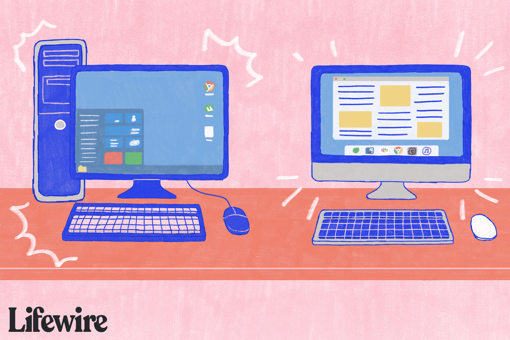

# 5 Key Concepts

On this page you will be shown 5 concepts from the textbook "Understanding Computers in a Changing Society,  6th Edition" by Deborah Morley. In additon, each will be followed up with the source (page) as well as a description of the concept in my own words.

## Microcomputer

*Page 19*

Microcomputers are small computers, often designed for personal/individual use. Because of this, they were often coined the term "[personal computer](https://www.britannica.com/technology/personal-computer)" or "PC" for short. Microcomputers came to be shortly after a time where computers, were several times larger; used by large organizations or business for [algorithmic processing or complex automation](https://scholar.lib.vt.edu/ejournals/SPT/v7n3/hong.html).

## Desktop computer

*Page 19*

A desktop computer is a personal computer that is designed for use on or beside a desk. They primarily come in two "forms":

- All in One computers feature the electronics built behind a display as a single "Unit".
- Alternatively, the electronics are built into an external chasis, seperate from the display, and are designed for either sitting vertically on the floor or flat on a desk.

>Image Source: [What Are All-In-One PCs?](https://www.lifewire.com/all-in-one-pcs-832299) - Lifewire

## Netbook / Laptop

*Page 21*

A notebook is a personal computer, traditionally of similar size to that of a paper notebook. In addition to their small size, they also boast a rechargable battery allowing for use without the need to be plugged in. It is also extremely light,  thin and has componenst such as the screen, keyboard, mouse, speakers and often more built into the chasis.

> A large list of differences can be seen on [GeeksForGeeks.org](https://www.geeksforgeeks.org/difference-between-desktop-and-laptop/)

## Portable Computers

*Page 21*

Portably computers are quite simple to understand; a computer that is portable. This can include many kinds of devices such as smartphones, tablets, laptops, handheld game systems.

## Embedded Computers

*Page 17*

Embedded computers are computers that are installed into another device designed to do a specific set of jobs. These jobs then available as functions or features that the device is able to rely upon. 

Some [common devices with embedded computers](https://www.deepseadev.com/en/blog/embedded-systems-examples/) include:
- Televisions
- DVD Players
- Microwaves
