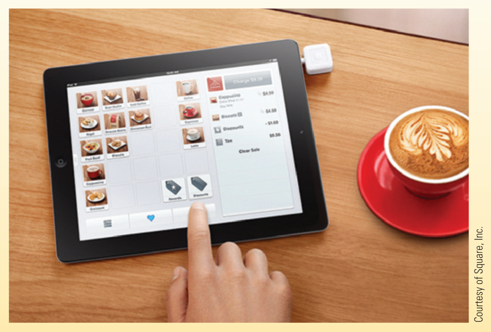

# 3 Trends

> All trends are direct from the course textbook, "Understanding Computers in a Changing Society,  6th Edition" by Deborah Morley. Each section will reference a specific page from within as the source and my own interpretation of each trend.

## iPad Ordering Systems

> Source: Page 7 "Technology and You"

iPads are already known for being convenient replacements in the resturant industry, allowing your server to take your order from the tablet or even being used as a Point of Sale device. This lead to the question "If staff can take customers orders from the iPad, why can't the customer place the order themselves?". Well this has become a lot more common place! Having an ordering system loading up on the tablet allows the customer to potentially see and do so much more with the menu such as see ingredients/allergens, add/remove specific ingredients from the order, order additional items without needing to call a server, translate the menu into different languages, the list goes on.

All those customization options allow the resturant to put less effort into constantly checking up on their patrions.Instead they have the understanding that if they need something the e-menu does not provide, then they can just call a server from the tablet. All those conveniences aside, this new system introduces the need for additional infrastructure considerations; consistent internet connection, redundancies for data if the internet is down, and "technologically challenged" customers are common things that need to be accounted for.

## Tiny PCs

> Source: Page 18 "Tiny PCs"

With technology doing as technology does, it shrinks. Nowadays it is not uncommon for computers that have physical dimensions similar to that of a flash drive. At their start, they were simple but unique devices that are often designed for a more specific purpose. For example, take your common "Media Stick" such as the Roku, Amazon Fire or Google Chromecast. Each of these devices are designed for one purpose: The display and output of media on your TV from (often) internet sources such as Netflix, Youtube, or Spotify.

At the start, Tiny PCs such as these fell into a fairly niche market. However, as more and more forms of media move to the internet they have risen in popularity to the point that many people have at least one in their home. Compared to Micro PCs, the primary appeal for these devices usually narrows down to the simplicity. Modern Tiny PCs even became common in homes with the elderly due to its easy to navigate and interact with menu's.

## Tech Clothing

> Source: Page 20 "Inside the Industry"

One rising trend from the late 19th and early 21st century was "Tech Clothing". Put simply, Tech Clothing was clothing designed with the accessability and security of your personal portable devices in mind. Like backpacks with hidden channels for wired headphones, or laptop sleeves; these particular garments were equipt with numerous pockets, channels and sleeves. This includes space for cell phones, portable media players, tablets and any number of portable mobile device you can think of. If you are on the go with any combination of these (or more), Tech Clothing may just be a trend that is (or was) for you!

As shown in the above picture from the textbook, in addition the simple storage space, it was not uncommon for manufactures to include clear, waterproof or mesh pouches. But how many pouches make sense? If you thought less than 24, you are sorely mistaken! This specific vest includes clear pouches that allows for use while stored, a system of channels for cable management and secure space for other, "non-tech" items such as your keys or wallet. Another appeal to Tech Clothing was that wherever you went, your items were always close by and organized. Instead of sticking them in a backpack where they can get jumbled together, knot up cables or work their way into creases or hard to see spots.
